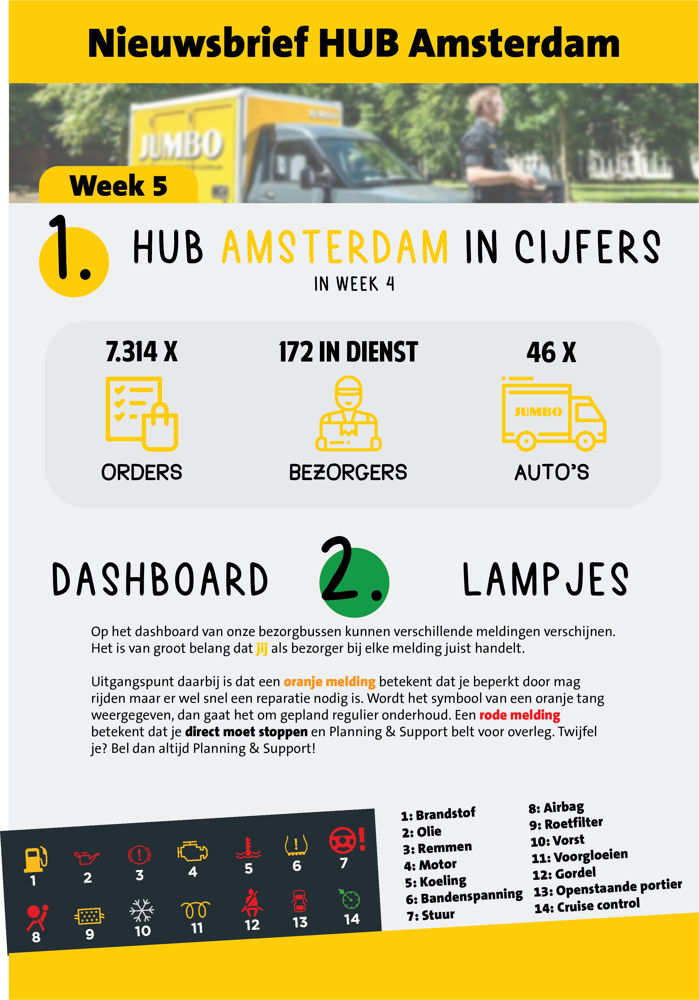

# Changelog Nieuwsbrief Week 5
All notable changes to this project will be documented in this file.

## [31-01-2020]
Nieuwsbrief_week_5 
- Def versie opgeleverd Erwin
- -  

## [30-01-2020]
Nieuwsbrief_week_5 
- Punten Erwin verwerken
- Verhaal Khalid aangepast
- Wist je dat aangepast
- Email adres aangepast feedback/ input

## [29-01-2020]
Nieuwsbrief_week_5 
- Update van versie 2
- Pagina twee toegevoegd
    - Verhaal Khalid verwerkt
    - Vrij aanvraag via ESS app
    - Wist je dat
    - Feedback/ input
-  

## [28-01-2020]
Nieuwsbrief_week_5 
- Tweede oplevering
- Andere layout
- Content toegevoegd
    - Dashboard lampjes
    - Orders per week
    - Bezorgers per week
    - Wagens per week
- 

## [27-01-2020 - Nieuwbrief_week_5]
Nieuwsbrief_week_5 
- Eerste oplevering 
-  

